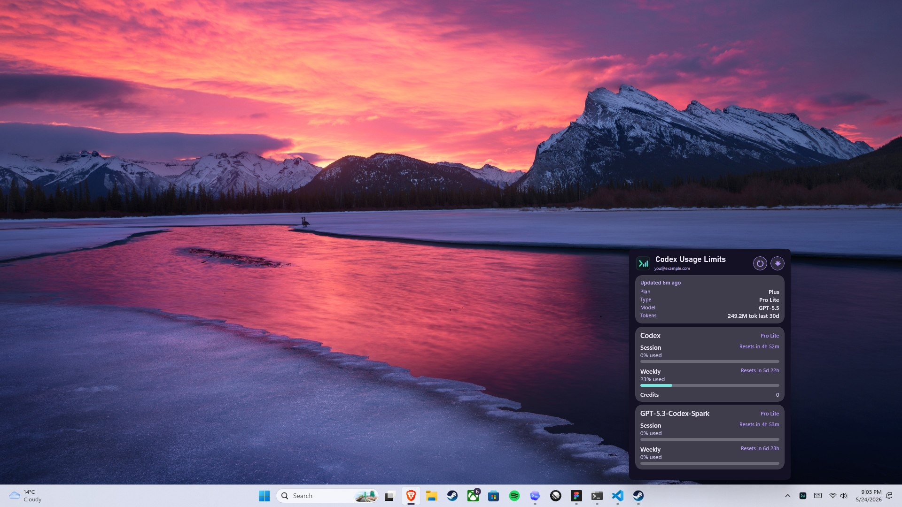
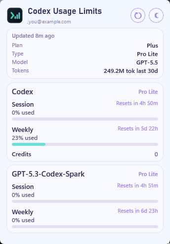
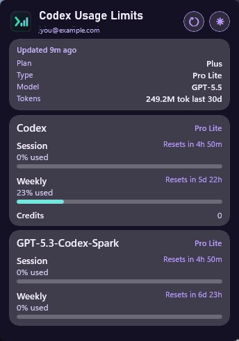

# CodexBarWin

**CodexBar for Windows. A native system tray app for Codex usage limits.**

CodexBarWin is a small Windows app for people who use OpenAI Codex and want a quick, low-friction way to see their usage. It runs in the Windows notification area and opens a compact flyout with the Codex account, plan, model, session usage, weekly usage, and reset times available on your machine.

This project is inspired by [Peter Steinberger's CodexBar](https://github.com/steipete/CodexBar), a macOS menu bar app for AI coding usage limits. CodexBarWin is not a copy, port, replacement, or substitute for CodexBar. It is a Windows-native tool built in the same spirit for users who wanted something similar in the Windows system tray.

CodexBarWin only supports Codex for now.

This project was created with AI assistance. You should feel free to inspect or build it yourself.

CodexBarWin is not affiliated with OpenAI.

## Screenshots



<p align="center">
  
  
</p>

## Features

- Windows system tray app for Codex usage limits.
- Compact flyout with light and dark themes.
- Session and weekly usage with reset countdowns.
- Additional Codex limit buckets when Codex returns them.
- Account email, plan, plan type, active model, credits, and local token estimate when available.
- Manual refresh from the flyout or tray menu.
- App-owned data stays local under `%LOCALAPPDATA%\CodexBarWin`.

## Requirements

To run the released app:

- Windows 11 22H2 or newer.
- Codex installed and signed in for the current Windows user.

To build or fork the source code:

- Windows 11 22H2 or newer.
- .NET 8 SDK.
- Git.
- Codex installed and signed in if you want live usage data while developing.

## Install

### Quick Start

1. Open the [CodexBarWin Releases page](https://github.com/k4rg1l/CodexBarWin/releases).
2. Download the latest `CodexBarWin-*-win-x64.exe`.
3. Run the file.
4. Click the CodexBarWin icon in the Windows system tray.

The release executable is self-contained, so you should not need to install the .NET runtime separately.

Early releases may show a Windows SmartScreen warning because the app is not code-signed yet.

### Run From Source

Clone the repo, then build from the repo root:

```powershell
dotnet build CodexBarWin.csproj -c Release
```

Run the built app:

```powershell
Start-Process -FilePath ".\bin\Release\net8.0-windows10.0.26100.0\win-x64\CodexBarWin.exe" -WorkingDirectory "."
```

## How Data Works

CodexBarWin reads usage from the local Codex installation for the current Windows user.

The primary path uses the Codex app-server:

1. Finds a Windows `codex` command.
2. Starts `codex app-server --listen stdio://`.
3. Reads account, rate-limit, config, and model data.
4. Normalizes that response for the flyout.

If that path is unavailable, CodexBarWin falls back to the local Codex auth file:

1. Reads `%USERPROFILE%\.codex\auth.json`.
2. Calls the ChatGPT usage endpoint with the local Codex auth token.
3. Normalizes the returned rate-limit data.

Local token estimates come from `%USERPROFILE%\.codex\sessions` JSONL logs. CodexBarWin shows token counts only, not dollar cost, because local token totals are estimates and are not billing-grade.

CodexBarWin does not run a cloud service and does not send telemetry. App-owned data is stored locally under `%LOCALAPPDATA%\CodexBarWin`. Persisted status, history, and logs redact email-like values and do not store OAuth tokens, refresh tokens, or account ids.
